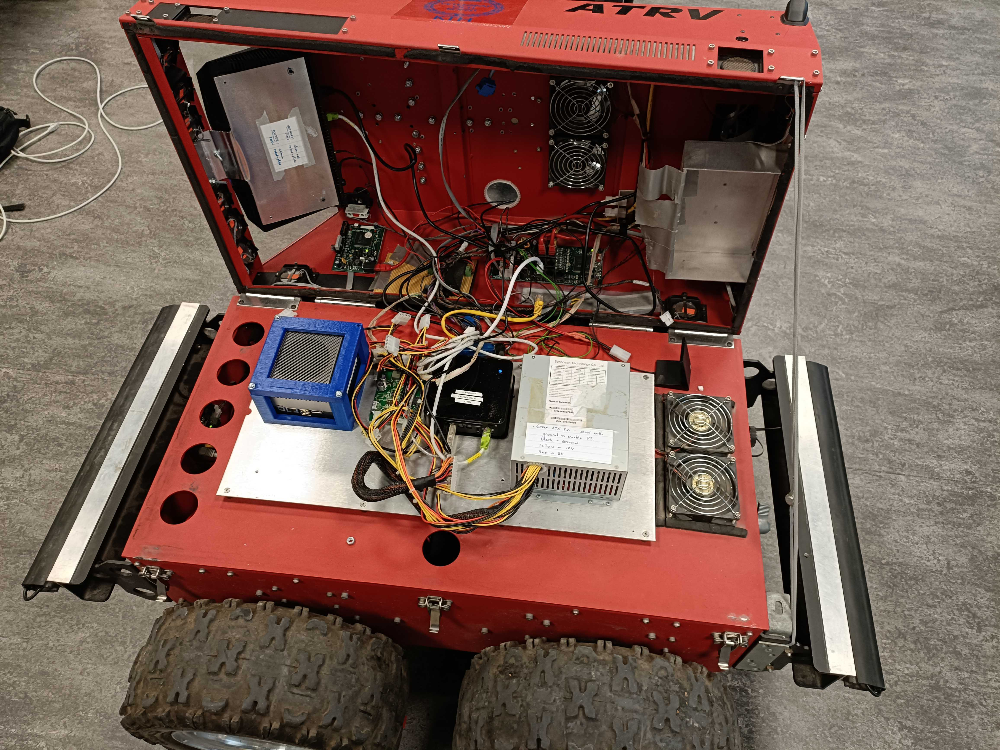
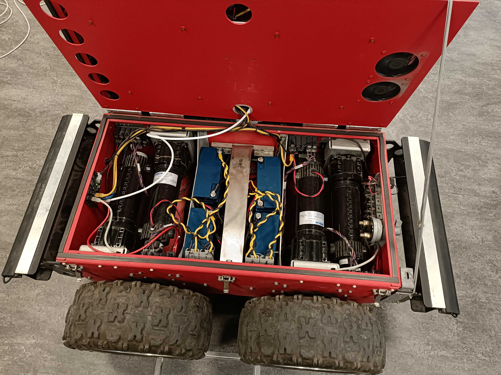
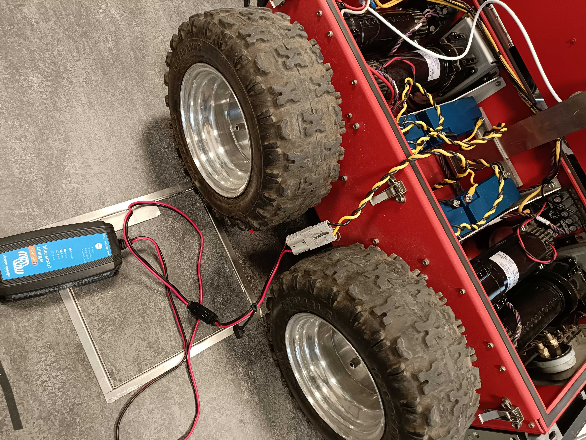
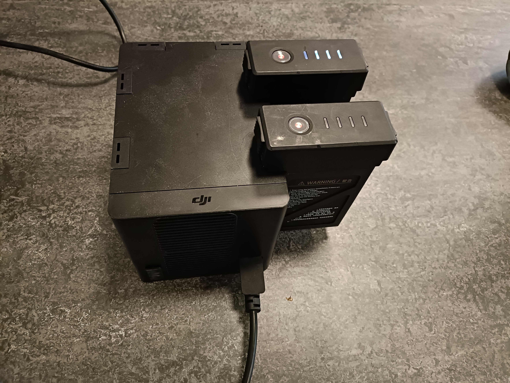
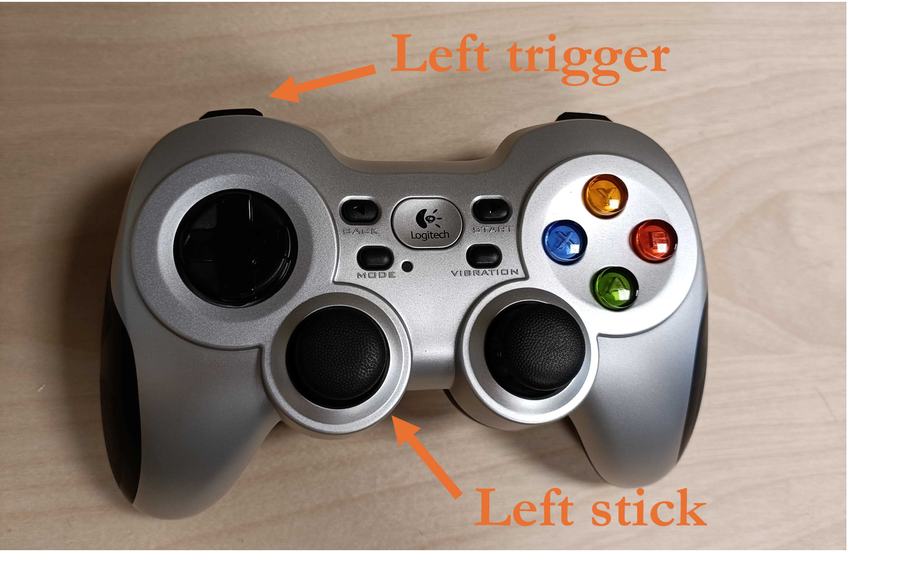
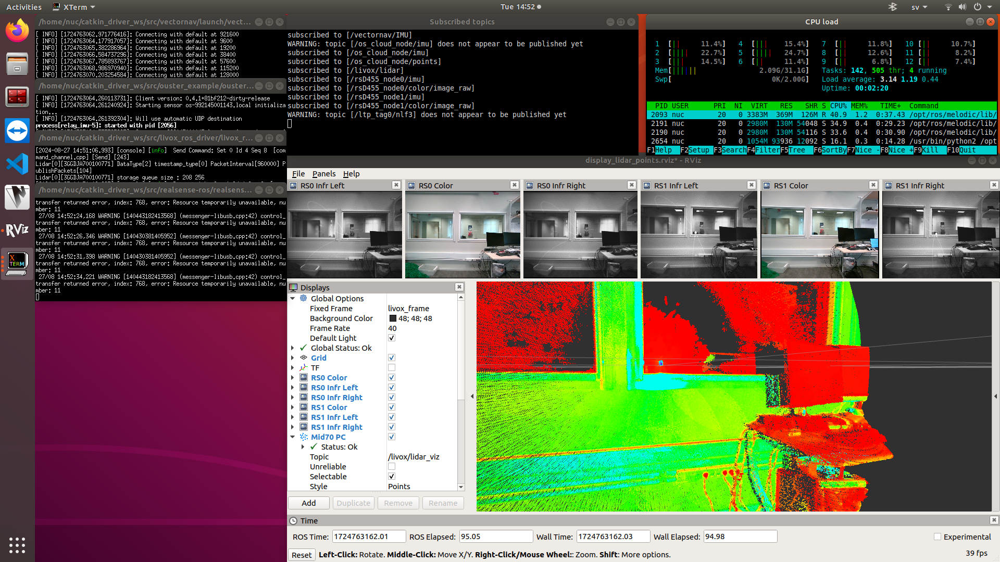
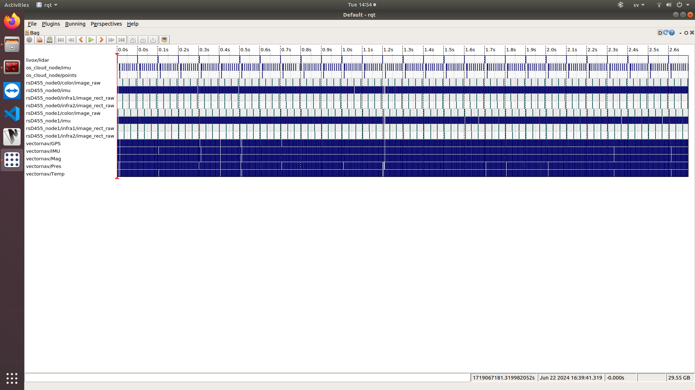
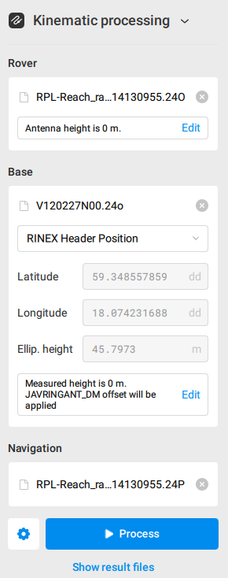
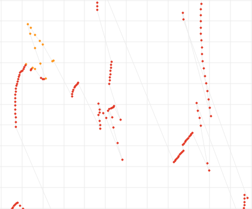

# Pluto-ATRV
A manual for the all terrain vehicle (ATRV) Pluto.

## Table of contents
- [Introduction](#Introduction)
- [Hardware](#Hardware)
    - [Computational Hardware](##Computational-Hardware)
    - [Sensor Hardware](##Sensor-Hardware)
    - [Mechanical & Electrical Hardware](##Mechanical-&-Electrical-Hardware)
- [Software](#Software)
    - [Sensor Rig](#Sensor-Rig)
    - [Robot Platform](#Robot-Platform)
- [Operation](#Operation)
    - [Getting It Moving](#Getting-It-Moving)
    - [Collecting Data](#Collecting-Data)
    - [Charging Batteries](#Charging-Batteries)
- [FAQ](#FAQ)
    - [Stuck!](##Stuck!)

# Introduction
Pluto is a bright red all terrain vehicle, produced by iRobot in the early 2000s (this is the Sr model, also called the ATRV-II). The company no longer offers support for this robot, which can make technical issues with the vehicle seem more daunting. While the chassis and lower level electronics remain similar to the old robot, a lot has been replaced or added to this robot. This manual aims to make it easier for future users to figure out the capabilities of Pluto, and to make use of it in their project.

It is possible to open up Pluto's hull to work with the interior components if necessary. To open up Pluto's hull, first ensure that the sensor rig, screen and any other lose components residing on Pluto will not fall or be damaged. Second, undo the three hinges on the left side of the robot hull. You can now pull open the top hull (think similarly to a pirate treasure chest!). 

Having opened the chassis, there is a second lid that can also be opened to reveal the engines and batteries (and some additional electronics). This results in Pluto having three different levels (see image):

# Hardware

## Sensor Hardware
Pluto comes equipped with a wide variety of sensor modalities. The main sensors are located in a mast on the front of the vehicle (see image below). This includes 

- 1x Ouster Os-1 Lidar, with 360 degree coverage
- 1x Livox Mid-70 Lidar, with front facing coverage
- 2x Intel realsense D455 RGBD cameras, with overlapping front facing coverage
- 1x VectorNav 200 IMU, mounted in between the lidars

However, there is also a GNSS mounted towards the rear of the vehicle (see image below). This sensor is mounted separately, as the OS-1 Lidar severely affects the reception capability of the GNSS antenna. The GNSS module is an Emlid Reach M2, with capability for RTK and PPK augmentations.

Manuals/specifications for these sensors are included in the folder named "datasheets". However, two things to also note:

1. The GNSS does not have a pdf reference, please instead see https://docs.emlid.com/reach/reference/specifications/specs/
2. The D455 cameras have a light sensitivity issue. We have included a document with description from Intel on this problem, and solved it by using NE06B filters from https://www.thorlabs.com/newgrouppage9.cfm?objectgroup_id=5011

## Computational Hardware
The robot has several different computer architectures on board. To collect data, the sensor rig has a separate Intel NUC, with x86 architecture. Pluto also has an older Intel NUC on the second level of the chassis, as well as an ARM based Nvidia Jetson AGX Orin.

Note that at the time of writing, the Jetson is not currently utilized by Pluto. This is planned to change in the future.

## Mechanical & Electrical Hardware
We use a wireless controller of the type "Logitech F710 Wireless Gamepad" to control the robot movement. The wireless reciever for this controller is connected to the Intel NUC on the second level of the robot chassis. To interact with the sensor rig, any type of bluetooth keyboard can be used.

There are four electrical DC Gearmotors in the vehicle, produced by Bison Gear & Engineering Corp. These motors are separately connected to each of the four wheels of the robot through toothed belts. As with most electric vehicles, this gives greater control opportunities, and Pluto is able to produce pure rotation without translation because of this. The motors each have the following electro-mechanical properties

- 0.25 Horsepower
- 24 Volt (DC)
- 10.78 Amps 
- 168 RPM
- 9.8 N-m Torque
- 11:1 Gear ratio

The robot has recently had its batteries replaced (mid 2024). While it used to run on EnerSys 12HX135FR lead acid batteries, it currently runs with four Victron LiFePO4 batteries, which each are 12,8V 20Ah. These power the engines, the two computers and the GNSS on Pluto. The sensor rig uses a separate power source, a TB47 DJI intelligent flight battery. The documentation on the Victron battery is included as a pdf. Also note that the drone lab currently has four TB47 batteries, but also four TB48 batteries which can be used interchangeably for the sensor rig if the need arises in the future (but are currently used for the DJI M300 drone).

## CAD files for 3D printing parts
There are files that can be 3D printed in the "3d files" folder. Both .par and .stl files are included, for easy printing and if further work on the parts are needed. A description of the use for each part is

- CAMERA_filter_holder: Used to attach the ND filter to the realsense cameras. One for each camera is needed.
- GPS_holder_flat: Used to attach the GNSS antenna in a raised fashion. Also doubles as space to put the receiver for the handheld controller.
- NUC_roof: Used to reduce how exposed the internal components of the electrics and the NUC are. Also reduces the number of exposed cables. 
- BATTERY_separator: Placed in the battery hold. With batteries being smaller than the hold size of the third level, keeps batteries from moving around. Made to be printable in a flashforge creator 3 (300x250x200mm), and to allow for placing 2 extra victron batteries in the middle if needed.

# Software
In general, software for sensors and actuation runs with Ubuntu 20.4, and ROS Noetic.

## Sensor Rig
The sensor rig has a few scripts to make collecting data easier. We include these scripts in the software section, in case these are needed. With a (wireless) keyboard connected to the sensor rig NUC, operation then becomes very simple (see operation section).

TODO: ADD SCRIPTS

## GNSS
The GNSS is separately interfaced with, using the Emlid Flow app (available for android and iOS) and wifi. This allows for the collection of data in a RINEX format, which is very useful for post-processing with any avaiable software on the market.

## Robot Platform
The software used to communicate between the NUC of Pluto and the internal electronics comes from https://github.com/migsdigs/iRobotATRV/tree/main. This was written by Miguel Garcia Naude when he worked at KTH, who has adapted it from previous works.

To ensure that users do not need to ssh into the NUC to start the above communication ROS software every time, a script written to launch the ROS nodes on powerup.

However, upon need it is still possible to ssh into Pluto. Pluto has its own router and wifi that can be connected to, where the passwords and usernames are written on the inside of the top chassis lid. 

# Operation

## Charging Batteries
Note: Charging batteries is a potential fire hazard. Make sure you are aware of the safety regulations at RPL, and where batteries are allowed to be charged before doing this.

The batteries used in Pluto can be accessed in the third level, beneath the two lids. Here, you can charge the batteries by connecting the Anderson power connectors one by one as shown in the figure below. We use a Victron blue smart 12V 15A charger, which can also be connected with over bluetooth (using VictronConnect app, the passwords for pairing are written on the side of the chargers) to control the charging cycle, or view charging details. Currently there are two such chargers at RPL, so charging can be done with two batteries at the same time to speed up the process. There is also a connector at the back of Pluto which connects to the power grid, and enables charging all four connected batteries at the same time, however we do not currently have a charger with compatible connection to this port. 

To charge the batteries used in the sensor rig, one needs to use a DJI hex charger. This allows connecting and charging up to 6 batteries at the same time. To charge the batteries, connect the hex charger to a wall socket with a computer power cord. Attach the batteries to be charged as seen in the figure below. Ensure that the lights on the batteries turn on, indicating charging.

## Getting It Moving
The first step is to turn on the power. This is controlled by the breaker mounted on the outside of the lower rear hull of Pluto. After this, one needs to press the knob that controls the Pluto console - at this point the fans should begin spinning, and after a short delay the console will boot and light up.

Wait a little bit, and then you can begin to turn off the brakes. There are two separate brakes which we call "real" and "virtual". The real brakes are controlled by the Pluto console, while the virtual brake is controlled by the Intel NUC of Pluto and its ROS software.

We illustrate the components needed for the following steps in three images below. To turn off the real brakes, ensure that the activation key is in a horizontal position. Then navigate to the brake menu in the Pluto console, and press the console knob. To then turn off the virtual brakes, press the upper left trigger on the handheld controller. It is now possible to control and move Pluto, using the left stick of the handheld controller. If you quickly need to reapply the brakes, use the emergency buttons located on all four corners of Pluto if reachable. Otherwise, apply the virtual brake from the handheld controller.

Note: There are no active brakes in the system. The brakes being applied relies on the inertia of the motors (which is quite tough to move, but the system can still be dragged/pushed at low speeds with the wheels turning slowly).

## Collecting Data

### Sensor Rig
Ensure that the sensor rig battery is charged and turned on. To turn on this battery, press the button once, and then hold the button. After this, turn on the NUC (power button is available from underneath). A screen is available to view the output of the sensors, and ensure that the collection is going well. As the NUC turns on, ensure that a keyboard is connected. With a keyboard connected to the NUC in the sensor rig, you can now use the follwing shorthand commands:

- Press CTRL + 1 to start the ROS nodes for sensors.  
- Press CTRL + 5 to start collecting sensor data in a rosbag.
- Press CTRL + 0 to stop collection, and turn off sensor nodes.

Assuming a screen is connected to the sensor rig, it would be expected to start looking like the following once CTRL + 1 is pressed (with a slight delay after pressing until everything turns on)

Note that once pressing CTRL + 5 to turn on collection, a separate terminal will pop up as well that controls the bag node. A word of advice is to collect some short data, and then inspect the data with the "rqt" command (needs a roscore running in a separate terminal). The bags are saved in a folder simply named "bags". You can inspect the bag and see that all the data is coming in as expected. A bag might look like the following.

### GNSS
To operate the GNSS, Emlid Flow app on a mobile unit (android/iOS). There are some basic instructions to follow to connect your phone to the Reach unit by wifi, see https://docs.emlid.com/reach/before-you-start/first-setup/. Note that the power to the Reach is turned on when Pluto is switched on.

Selecting the RPL-Reach:EC:ED connection (password is the default in the setup instructions from the link above), you gain access to changing settings, recording data, and downloading recorded data. You can also see the status of the GNSS connection, number of visible satellites, noise to signal ratio, and so on.

Depending on the accuracy needed in your project data, you can rely on normal GNSS, or you can use PPK to postprocess the data. Postprocessing the data can be done using a number of available free software suites. Here we briefly describe how to use Emlid Studio https://emlid.com/emlid-studio/, which is available for free on Windows and Mac. 

The postprocessing requires two of the files from the recording, the observation file (.O) and the navigation file (.P). We also need an observation file from a base station. There is a network of static GNSS stations in Sweden that can be used for correction data, run by Swepos. To access these corrections, you can either download it yourself through Swepos ftp servers https://www.lantmateriet.se/en/geodata/gps-geodesi-och-swepos/swepos/swepos-services/post-processing/rinex-data/, or you can get a subscription for free virtual RINEX files from Swepos. Such subscriptions are free for those working in research or universities in Sweden (you simply need to contact Swepos support over email), and it gives you access to order as many correction files as you want. 

With these three files, input them as shown in the image below in Emlid Studio, and then process the path. You will get a resultant .pos file, which gives you timestamps, locations and associated uncertainties.

Note: You will need a relatively stable connection to GNSS to get a good path accuracy. An example of a good path that you can achieve with this postprocessing is shown first below. The grids represent 20cm intervals, and the data has a standard deviation in position below 3cm. 

Here is an example of a bad path with poor connection, shown below as well. The grids in the image represent 2m. Therefore, if you want really accurate GNSS data, consider planning a path to where the sky is not covered too much.

# FAQ

## I would like to use Pluto for a project, who can I talk to?
The robot is owned by professor Patric Jensfelt, and used for projects by doctoral student Waqas Ali (2024-), reach out if you are interested.

## The robot is making noise during operation, is this normal?
There are several sources of "irregular" noise, which are not necessarily cause for alarm. The sounds that are emitted normally but which might be interpreted as problematic are the lidar and engine belts. While the sensor rig is on, the Livox lidar emits a "grinding", almost "sandy" noise. When the robot moves, it sometimes emits a sharp thumping sound. This is a sound coming from an engine belt.

It can be hard to recognize if these are the sounds that are being heard. Think critically on if you believe the sounds emanating are actually signs of damage, or just normal operation.

## Why is the robot not moving?
Here are the most likely reasons for why the robot is not moving. Check in the following order

- Ensure that BOTH the real brake and virtual brakes are turned off. See "Operation/Getting It Moving".
- Wait a little for the ROS software to turn on before you try to deactive the virtual brake.
- Ensure that you have not accidentally pressed "mode" on the handheld controller. 
- Is there enough charge in the main batteries that power the engine? Check the battery voltage in the console. A nominal voltage with fully charged batteries will display anything in the range of 25.4 to 26 Volt. If you are several Volt below that, there is reason to suspect this cause.
- Are the batteries (2xAA) in the handheld controller dead?
- The USB based reciever for the handheld controller has been accidentally disconnected from the NUC inside Pluto.
- Open up the chassis fully to check the engine level. There are several motor driver PCBs which are connected to the upper level by an ethernet cable. This cable can become loose - if the lights of the PCBs at the lowest level are red (blinking or solid color), then the cable is not fully connected and cannot transmit a signal. Try wiggling the cable which connects the upper and lower level at the connection point (not forcefully), or replace it.
